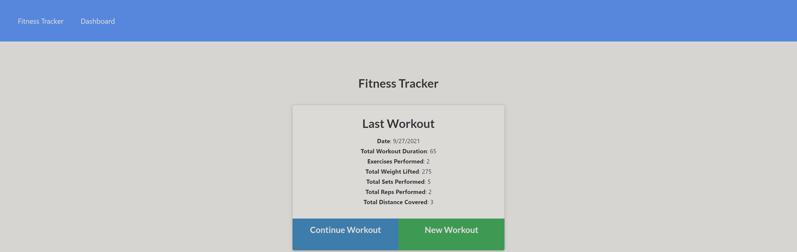
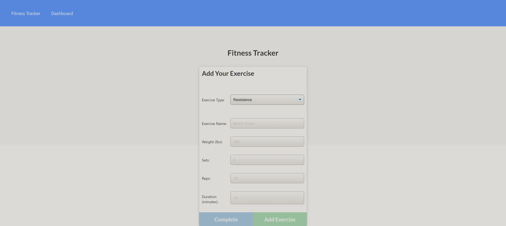
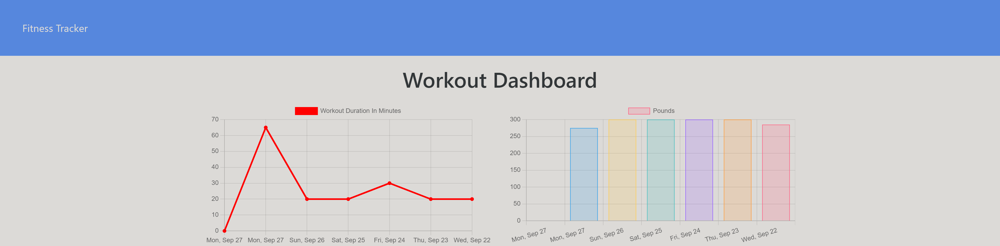

# Nosql : Workout Tracker

## Purpose

The purpose of this project was to create a functional workout tracking app from an existing front-end. This project required creating the database integration for the app and adding functionality to all of the existing features. 

Some features of the app are:

- When the user first loads the page they are shown one of two things:
  - If they have not entered any workouts previously they are prompted to create one. 
  - If they have entered workouts previously they are given a summary of the most recent workout and are then given the choice to add exercises to it or create a new one. 
- When creating a new workout the user can add multiple exercises to it. 
- All workouts are stored in a mogoDB database. 
- The user is able to view a dashboard that will display the total duration and total weight lifted for the past 7 workouts they have entered. 

The application can be found at: https://quiet-peak-38275.herokuapp.com/

---

## Appearance

### Here is an example of the landing page for a return user:

### Here is an example of a user entering in a new exercise:

### Here is an example the dashboard the user will see once they have entered workouts:

